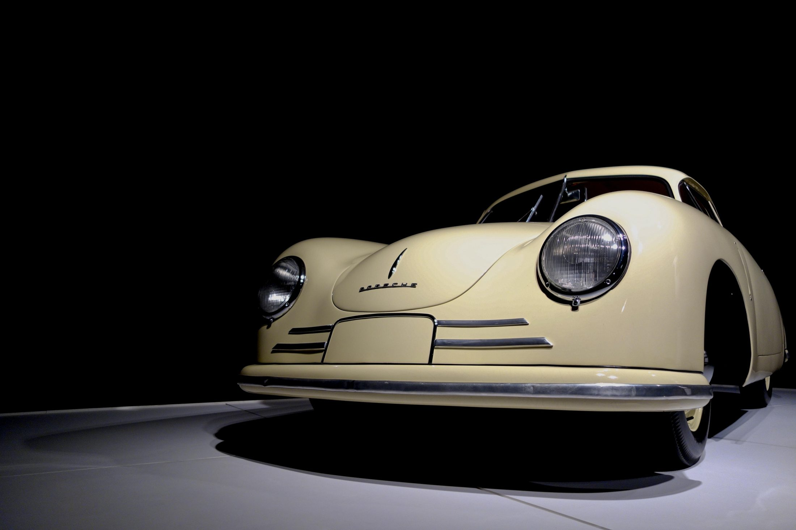

# Gilbert B Hammer — Photography

A single-page personal photography portfolio: plain static HTML/CSS, no build step, no framework — same approach as the HMG Preserve Media site.

## Structure
```
index.html      The whole site (one scrolling page)
styles.css      All styling — colors, type, layout
uploads/        Real photos go here once you have them
package.json    "npm start" serves the folder locally / on Railway
server.js       Minimal static file server
```

## Current state
Every gallery photo is a placeholder (a colored gradient tile with a small icon) — there are no real images wired in yet. Each spot is marked in `index.html` with an HTML comment, e.g.:

```html
<div class="photo tone-a">
  <!-- Photo slot: Commercial — replace this div's contents with  when a photo is ready -->
  ...
</div>
```

## Swapping in a real photo
1. Drop the image file into `uploads/` (e.g. `uploads/commercial-1.jpg`).
2. In `index.html`, find that section's `<div class="photo tone-*">` and replace its contents with:
   ```html
   
   ```
3. Commit and push — Railway redeploys automatically.

If you'd rather not touch the HTML yourself, just send the photos (and which section each belongs to) in a Cowork session and it'll be wired in and pushed for you.

## Deploying via GitHub + Railway
1. Push the contents of this folder to a new GitHub repo (root of the repo = root of the site) — e.g. `HMG14/gilbert-photography`.
2. In Railway: New Project → Deploy from GitHub repo → pick the repo.
3. Railway detects `package.json` and runs `npm install && npm start`, serving the site on Railway's assigned `$PORT`.
4. Point the `gilbert.photography.hammermediagroup.com` subdomain's DNS (a CNAME) at the Railway service, then add the domain in Railway's project settings.
5. No environment variables or database needed.

## Design tokens
All colors/type come from CSS variables at the top of `styles.css` (`--bg`, `--fg`, `--accent`, etc.) plus Google Fonts Instrument Serif (headlines), Work Sans (body), Bricolage Grotesque (nameplate).

## Still placeholder / to fill in
- Hero photograph (currently a gradient background)
- Artist statement is set; hero and gallery photos still to come
- Contact section copy (`[contact email or form goes here]`) — currently the button is a `mailto:` link to gilbert@hammermediagroup.com
- Instagram / LinkedIn footer links (currently `#`)
